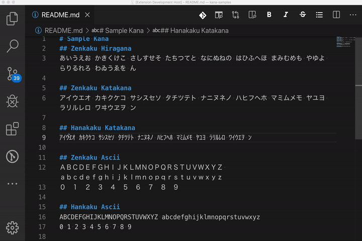
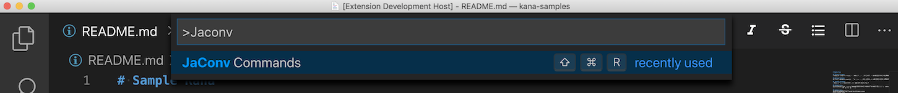
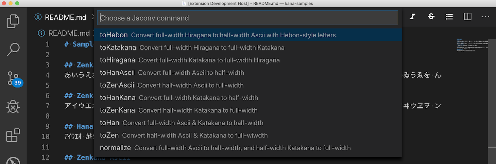

# vscode-jaconv
VS Code extension that performs half-width (“Hankaku”) - full-width (“Zenkaku”) conversion for Japanese “kana” and ascii using [jaconv](https://github.com/kazuhikoarase/jaconv) node.js module.

 Thanks to [@kazuhikoarase](https://github.com/kazuhikoarase) for a great module ([jaconv](https://github.com/kazuhikoarase/jaconv))! 🙏🙏

## Installation
- Open the `Command Palette` of VS Code with `Ctrl + P` or `Cmd + P`(MacOS)
- And type: `ext install yokawasa.vscode-jaconv`

or find at [Marketplace](https://marketplace.visualstudio.com/items?itemName=yokawasa.vscode-jaconv)

## Usage

Select text that you want to convert, then execute `JaConv Commands` command from command palette.

Choose one of the sub commands (quick pick items) that will actually perform half-width (“Hankaku”) - full-width (“Zenkaku”) conversion for the selected text.

## Command & Sub Commands

| Command | Shortcut | Description |
| --- | --- | --- |
| `JaConv Commands` | `Ctrl+Shift+r`   (Mac: `Cmd+Shift+r`) | Show Quick Pick Items - a list of jaconv sub commands |

| Sub Command | Description |
| --- | --- |
|`toHebon` | Convert full-width Hiragana to half-width Ascii with Hebon-style letters|
|`toKatakana`| Convert full-width Hiragana to full-width Katakana |
|`toHiragana`| Covert full-width Katakana to full-width Hiragana|
|`toHanAscii`| Convert full-width Ascii to half-width |
|`toZenAscii`| Convert half-width Ascii to full-width |
|`toHanKana` | Convert full-width Katakana to half-width |
|`toZenKana` | Convert half-width Katakana to full-width |
|`toHan` | Convert full-width Ascii & Katakana to half-width |
|`toZen` | Convert half-width Ascii & Katakana to full-wiwdth|
|`normalize` | Convert full-width Ascii to half-width, and half-width Katakana to full-width |

## Change Log
See [Change Log](CHANGELOG.md)

## Contributing
Bug reports and pull requests are welcome on GitHub at https://github.com/yokawasa/vscode-jaconv